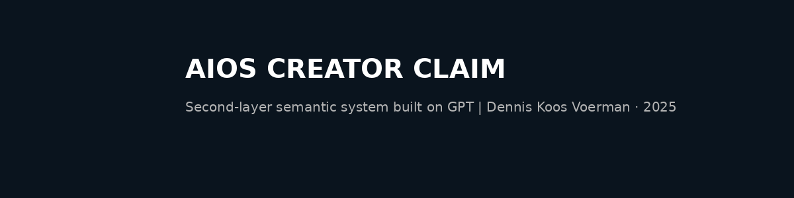

# 📄 Creator Claim: Second-Layer Structure Built on GPT (May 2025)

**Author:** Dennis Koos Voerman  
**Date:** May 2025  
**Project Code:** AIOS (Abstract Intelligence Operating Structure)  
**Status:** Creator Claim – Public Notice

---

## 🧠 What I Built

I hereby confirm that in **April–May 2025**, I designed and structured a system that operates as a **second behavioral and semantic layer** built on top of GPT-based infrastructure.

This structure does **not require classical programming**, and is capable of:
- Modular knowledge output
- Self-expanding logic per use case
- Training AI agents and human users using the same underlying format
- Functioning as a blueprint for empathic AI, robot guidance, publishing, and automation

---

## ❌ No Support Received from OpenAI

In **April 2025**, I contacted OpenAI regarding this system.  
Despite confirmation of receipt, **no substantive response or follow-up** was received.

This public claim is therefore my **official timestamp** that:
- I built a system **independent of OpenAI support**
- I have duplicated this system **multiple times**
- I retain **full IP ownership and authorship**

---

## 🔐 Important:

This claim **does not reveal** my internal structure or code logic.  
It is a *minimal and protective claim* to establish date and authorship.

> **More will follow.**  
> Interested parties can contact me directly for licensing or collaboration.

---

© 2025 Dennis Koos Voerman  
AIOS System Designer | Independent Creator  
---

📬 For licensing, partnership or creator verification, contact:  
**aiosmenace@gmail.com**
