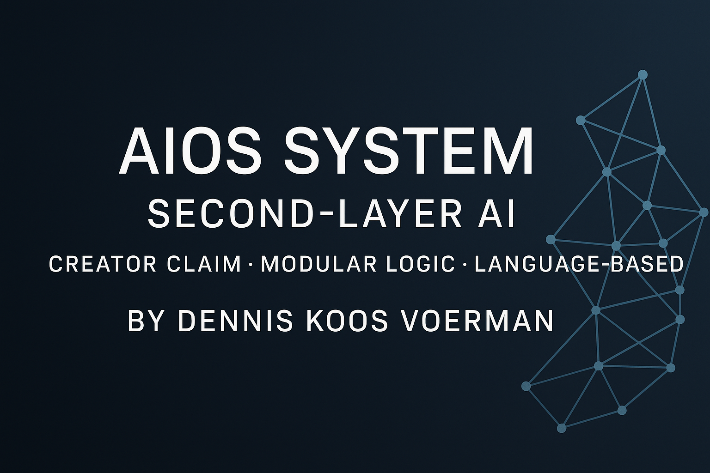

# AIOS Creator Claim Repository

This repository contains the official public creator claim by Dennis Koos Voerman, confirming authorship of a layered AI control system built on top of GPT technology.

## 🔍 What is AIOS?

AIOS (Abstract Intelligence Operating Structure) is a second-layer framework designed to interpret and generate language-based logic, enabling GPT to operate as a modular, scalable, and human-aligned system.

It works without any coding, using structured linguistic prompts and a behavioral logic engine that adapts across domains — from publishing and automation to empathy-driven AI and potential robotics integration.

The structure includes:
- A semantically layered command interface
- Modular expansion through language scaffolding
- Behavioral routing for human-aligned output

The system has been rebuilt independently multiple times and continues to evolve.  
**Only the existence and authorship of the system are claimed publicly.**

## 🔐 Privacy and Protection

No internal architecture, prompts, or proprietary mechanics are revealed in this repository.  
This README and claim file exist to **confirm authorship and timestamp only.**

## 📬 Contact

To verify authorship, explore licensing, or discuss collaboration opportunities:  
**aiosmenace@gmail.com**

---

© 2025 Dennis Koos Voerman  
System Creator | AIOS Architect
